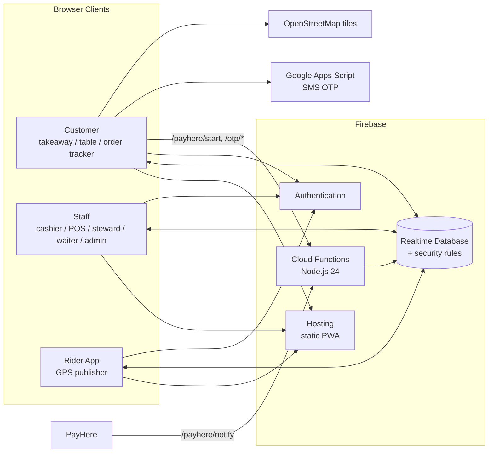
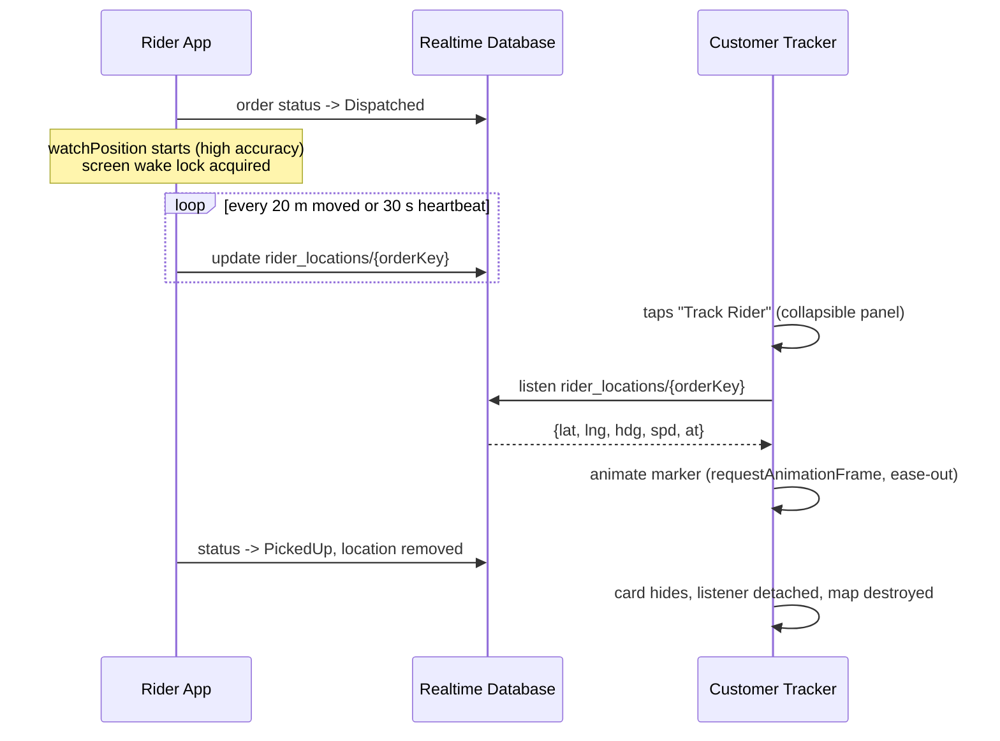

# Peoples Family Restaurant — Ordering, POS & Live Rider Tracking

A production restaurant platform for **Peoples Family Restaurant (Peoples Bakers), Horana, Sri Lanka**. It covers online takeaway and doorstep delivery, QR table ordering, cashier and POS screens, kitchen/steward workflows, a rider app, and **real-time live rider tracking**. Everything is built on Firebase with a serverless, real-time architecture.

**Live:** [peoplesfamilyrestaurant.lk](https://peoplesfamilyrestaurant.lk)

---

## Highlights

- **Real-time everything.** Orders, statuses, chats and rider positions sync instantly across customers, cashier, kitchen and riders through Firebase Realtime Database listeners.
- **Live rider tracking.** Riders stream throttled GPS while an order is on the way. Customers open a collapsible **Track Rider** map (Leaflet + OpenStreetMap) with a smoothly animated, heading-aware rider marker, distance, ETA and a signal-freshness indicator.
- **Role-based security.** Detailed Realtime Database rules give customers, riders, cashiers, stewards and admins only the access they need, down to individual fields and status transitions.
- **Bilingual UX.** Sinhala + English throughout, tuned for mobile-first customers and busy staff.
- **Staff alerting.** Loud, repeating Web Audio order alarms with per-device volume control, voice announcements for riders, and browser notifications for customers.
- **Payments.** Cash, bank-slip verification and PayHere online payments, with server-side hash signing.
- **Installable PWA.** Web manifest plus a service worker.

---

## Tech Stack

| Layer | Technology |
|---|---|
| Frontend | HTML5, vanilla JavaScript (ES2017+), [Tailwind CSS](https://tailwindcss.com) |
| Maps | [Leaflet.js 1.9](https://leafletjs.com) + [OpenStreetMap](https://www.openstreetmap.org) tiles (free, no API key) |
| Database | [Firebase Realtime Database](https://firebase.google.com/docs/database) |
| Auth | Firebase Authentication (anonymous customers, email/password staff and riders) |
| Hosting | Firebase Hosting (rewrites, security headers, cache control) |
| Backend | Cloud Functions for Firebase on **Node.js 24** (`firebase-functions` v7, `firebase-admin`, `nodemailer`) |
| Secrets | Firebase Secret Manager (`defineSecret`), Google Apps Script Script Properties |
| SMS OTP | Google Apps Script web app + Notify.lk gateway |
| Browser APIs | Geolocation (`watchPosition`), Screen Wake Lock, Web Audio, Notifications, Service Worker |

---

## Architecture



### Applications

| Route | Page | Purpose |
|---|---|---|
| `/` | `takeaway.html` | Online menu, cart, pickup / doorstep delivery with map pin, checkout |
| `/index.html` | `table.html` | QR table ordering for dine-in guests |
| `/order` | `order.html` | Customer live order tracker, chat, bank-slip upload, **Track Rider** map |
| `/cashier` | `cashier.html` | Live order board, payment verification, settle bills, order alarms |
| `/pos` | `pos.html` | Counter point-of-sale |
| `/rider` | `rider.html` | Rider jobs, claiming, batch routes, cash wallet, **live GPS sharing** |
| — | `steward.html`, `waiter.html` | Dine-in service and table workflows |
| `/admin` | `admin.html` | Menu, categories, pricing, staff, riders, shop hours, payments settings |
| `/staff-login` | `staff-login.html` | Station and staff sign-in |

Shared logic lives in `public/js/firebase-config.js` (helpers, order ID sequencing, alerts, payment and tracker utilities) and `public/js/auth-guard.js` (staff route protection).

### Cloud Functions

| Function | Route | Description |
|---|---|---|
| `payhereStart` | `/payhere/start` | Builds a signed PayHere checkout request; the merchant secret never leaves the server |
| `payhereNotify` | `/payhere/notify` | Verifies the PayHere callback hash and marks the order as paid |
| `sendEmailOtp` | `/otp/send` | Emails a one-time code (hashed at rest, rate-limited) |
| `verifyEmailOtp` | `/otp/verify` | Verifies the code with attempt limits |

---

## Real-time Live Rider Tracking



**Rider side (`rider.html`)**
- A single `navigator.geolocation.watchPosition` runs only while the rider has an active doorstep order in `Dispatched` / `Arrived`.
- **Adaptive throttling:** a location is published when the rider moves ≥ 20 m, moves ≥ 5 m after 10 s, or as a 30 s heartbeat. Low-accuracy fixes (> 100 m) are dropped.
- **One multi-path write** updates every active order at once, which keeps writes minimal.
- Locations are removed on delivery or release, and via `onDisconnect()` if the app closes.
- The Screen Wake Lock API keeps GPS alive during deliveries. A status pill shows sharing state and permission problems.

**Customer side (`order.html`)**
- A **Track Rider** card slides the map open and closed (CSS grid-rows transition). Leaflet is lazy-loaded on first open, so customers who never open it spend no data.
- The rider marker glides between updates, rotates with heading, and shows distance, an approximate ETA and "updated Xs ago". A "signal weak" warning appears after 90 s without updates.
- Collapsing detaches the database listener. Delivery or cancellation tears the map down entirely.

**Data model.** Tracking uses a dedicated node, so the order records are never touched:

```json
"rider_locations": {
  "<orderKey>": { "lat": 6.7160, "lng": 80.0712, "acc": 10, "hdg": 135, "spd": 8.1, "at": 1790000000000, "riderId": "7XXXXXXXX" }
}
```

---

## Security Model

All authorization is enforced server-side in [`database.rules.json`](database.rules.json):

- **Customers** (anonymous auth) can create orders only in an initial state, read only their own orders, and make only limited updates (cancel while not started, upload a bank slip). Totals, fees, rider assignment and payment status are immutable to them.
- **Riders** must be admin-approved (`approved_riders/{uid}`). They can claim unassigned delivery jobs and move only their own orders through `Dispatched → Arrived → PickedUp`.
- **Rider locations** can be written only by the rider assigned to that order, and only while it is `Dispatched` or `Arrived`. They are readable only by that order's customer, staff and the assigned rider. Values are schema-validated: coordinate ranges, timestamp sanity, matching rider id, and no unknown fields.
- **Staff** roles (admin / cashier / steward, including station logins) are derived from the verified auth email pattern. Sensitive nodes such as `settings/payhere_secret` and `email_otps` are unreadable from any client.
- **Order numbers** (`PB-001`, `PB-002`, …) come from an atomic transaction on `order_seq/{day}`. The rules only allow +1 increments.

**Secrets are never committed.** The Gmail credentials live in Firebase Secret Manager, the PayHere secret sits in a client-unreadable database path, and the SMS gateway keys are stored in Apps Script Script Properties. The Firebase web config in `firebase-config.js` is a public project identifier by design; access is governed by the rules above.

---

## Project Structure

```
.
├── public/                  # Firebase Hosting root (PWA)
│   ├── takeaway.html        # customer online ordering
│   ├── table.html           # QR table ordering
│   ├── order.html           # live order tracker + Track Rider map
│   ├── cashier.html · pos.html · steward.html · waiter.html
│   ├── rider.html           # rider app + GPS publisher
│   ├── admin.html · staff-login.html
│   ├── js/firebase-config.js · js/auth-guard.js
│   ├── manifest.json · sw.js · sitemap.xml · robots.txt
├── functions/               # Cloud Functions (Node.js 24)
│   └── index.js
├── otp/ · google-apps-script/   # Apps Script SMS / OTP sources
├── database.rules.json      # Realtime Database security rules
└── firebase.json            # hosting rewrites, headers, emulators
```

---

## Getting Started

**Prerequisites:** Node.js 24, [Firebase CLI](https://firebase.google.com/docs/cli), and Java (for the Database Emulator).

```bash
git clone https://github.com/<your-username>/<repo-name>.git
cd <repo-name>

# Cloud Functions dependencies
cd functions && npm install && cd ..

# Run the site locally (static server)
npx serve public            # or: python -m http.server --directory public

# Test security rules locally against the emulator
firebase emulators:start --only database
```

To point the app at your own Firebase project, replace `PEOPLES_FIREBASE_CONFIG` in `public/js/firebase-config.js` and the project id in `.firebaserc`.

### Configure secrets (for your own deployment)

```bash
firebase functions:secrets:set GMAIL_USER
firebase functions:secrets:set GMAIL_APP_PASSWORD
```

Set the PayHere merchant id and secret from the Admin panel. For SMS OTP, add `NOTIFY_USER_ID`, `NOTIFY_API_KEY` and `NOTIFY_SENDER_ID` under the Apps Script project's **Script Properties**.

### Deploy

```bash
firebase deploy --only hosting            # website
firebase deploy --only database           # security rules
firebase deploy --only functions          # Cloud Functions (Blaze plan)
```

---

## Performance & Reliability Notes

- **Battery:** GPS runs only during active deliveries, with distance/time throttling and a hard stop on completion.
- **Bandwidth:** location payloads are about 150 bytes. Map tiles and Leaflet load only when a customer opens the tracker.
- **Resilience:** there are offline banners for staff, listener error recovery, transaction-based order claiming (no double assignment), and cache-busted shared scripts.
- **Web platform limit:** browsers throttle GPS in background tabs, so riders keep the app open during delivery (the wake lock assists).

---

## License

Copyright © Peoples Family Restaurant, Horana. All rights reserved. The source is published for portfolio and reference purposes.
